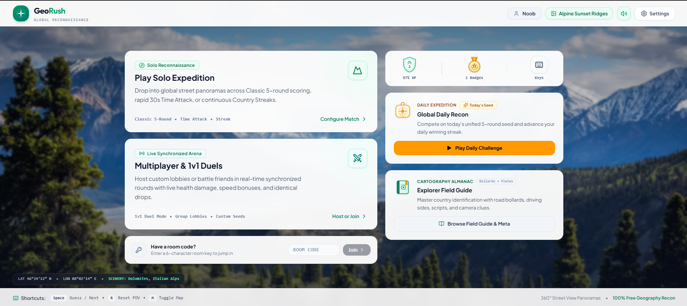
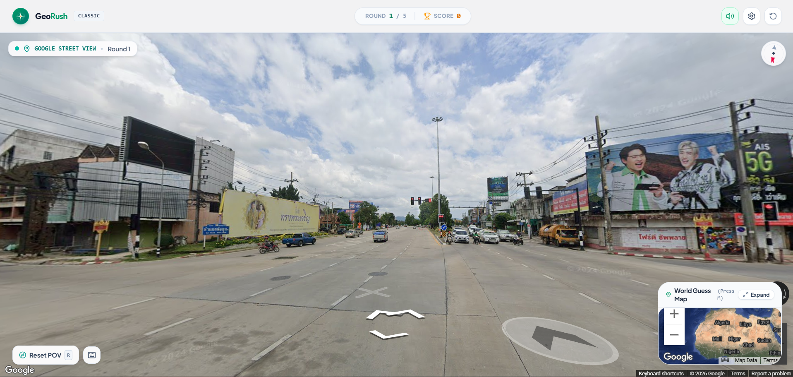
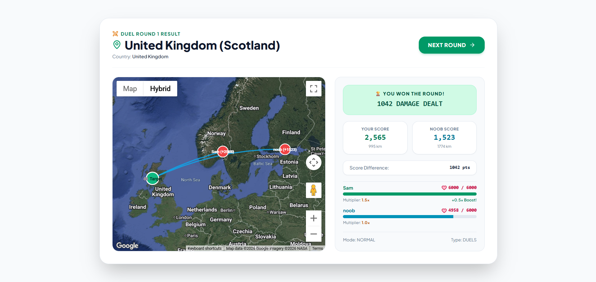
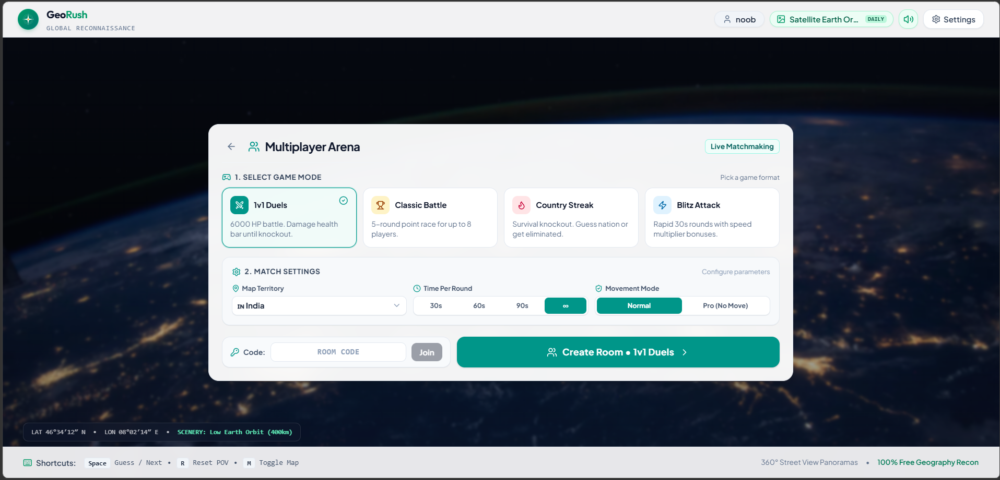
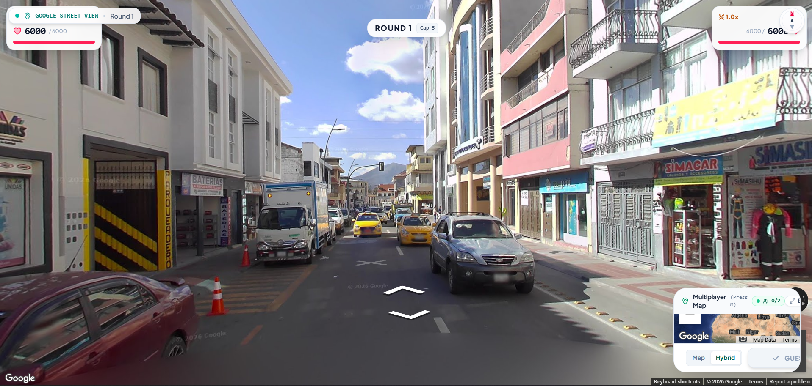
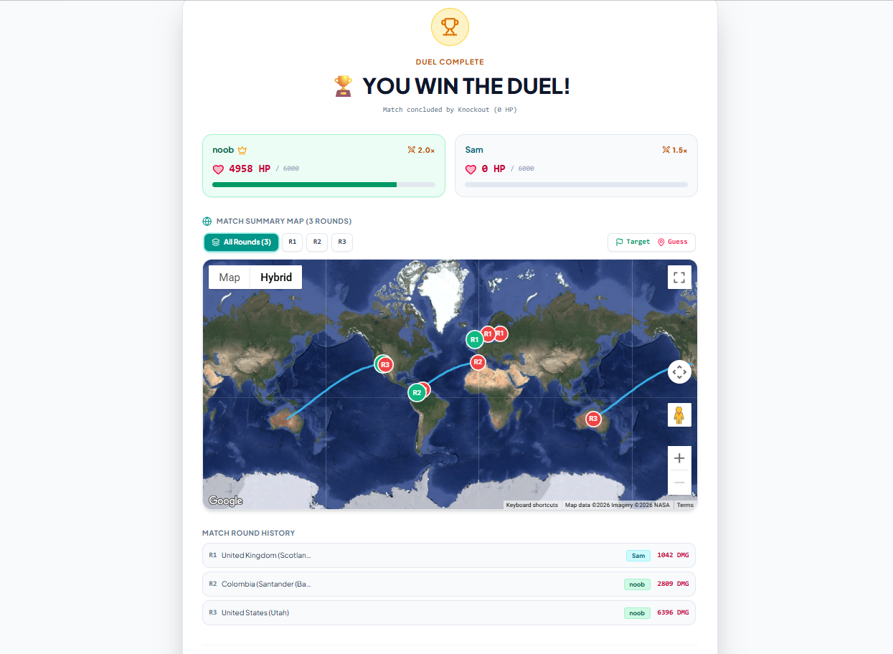

# 🌍 GeoRush

> A real-time multiplayer and single-player geography guessing game built with React, TypeScript, Express, Socket.IO, and Google Maps Platform.

**Live Demo:** [Play GeoRush](https://georush-325537025683.asia-south1.run.app/)

---

## 📖 Overview

GeoRush is a geography guessing game where players explore 360° Street View panoramas and use visual clues such as architecture, road markings, language, scripts, and terrain to determine where they are.

The game combines **single-player challenges, real-time multiplayer, asynchronous friend challenges, daily competition, learning resources, progression, achievements, and customization** into one geography-focused experience.

Google Maps Platform provides the real Street View and interactive map experience, while a mock panorama mode and Leaflet/OpenStreetMap map fallback are available for development and environments where Google Maps is unavailable.

---

## 🎮 Game Modes

### Singleplayer

| Mode | Description |
|---|---|
| **Classic** | Five-round global location guessing challenge with distance-based scoring. |
| **Country Streak** | Identify the country of each location and maintain your streak. |
| **Time Attack** | Fast-paced rounds where quicker guesses receive a higher score multiplier. |
| **Daily Challenge** | A fixed daily challenge shared across players, available once per day. |

### Multiplayer

GeoRush uses **Socket.IO** for real-time multiplayer communication.

| Mode | Description |
|---|---|
| **Classic Lobby** | Multiplayer match where players compete across multiple rounds for the highest cumulative score. |
| **1v1 Duels** | Head-to-head HP-based competition where round performance determines damage. |
| **Country Streak** | Multiplayer elimination mode where incorrect country guesses eliminate players. |
| **Time Attack** | Synchronized speed-based multiplayer rounds combining proximity and time-based scoring. |

---

## 📅 Daily Challenge

The Daily Challenge gives every player the same fixed challenge for the day.

- 🌎 **World Map**
- 🎮 **Normal Mode**
- ⏱️ **2-minute timer**
- ⚙️ **Fixed game settings**
- 🔄 Refreshes every day at **12 PM**
- 🎯 Players can attempt it **only once per day**

The deterministic daily setup allows players to compete on the same challenge rather than receiving independently generated rounds.

---

## 🤝 Challenge a Friend

After completing a single-player game, players can use **Challenge a Friend** to create an asynchronous challenge.

### How it works

```text
Complete Singleplayer Game
          │
          ▼
     Challenge a Friend
          │
          ▼
    Generate Challenge Link
          │
          ▼
      Share the Link
          │
          ▼
   Friend Opens the Link
          │
          ▼
Same Rounds / Same Seed
          │
          ▼
      Score to Beat
```

The invited player receives the **same rounds/seed** used by the original player and competes against the displayed score to beat.

This allows two players to compete without needing to be online at the same time.

---

## 📖 Explorer Field Guide

The **Explorer Field Guide** is a learning section available directly from the home screen.

It helps players learn geographical clues that can improve their performance during gameplay.

Topics include:

- 🚗 Countries and regions that drive on the left or right side of the road
- 🔤 Differences between alphabets and scripts used by different countries
- 🪧 Bollards and roadside posts
- 🌍 Other visual geography clues useful for location identification

The Field Guide turns GeoRush into more than just a guessing game by giving players resources to **learn the clues used to make better guesses**.

---

## ⭐ XP, Levels & Achievements

GeoRush includes a player progression system that rewards continued play.

### XP & Levels

Players earn **XP through gameplay**, allowing them to progress through levels as they continue playing.

### Achievements

GeoRush includes achievements for different styles of performance:

| Achievement | Focus |
|---|---|
| 🎯 **Bullseye** | Exceptional location accuracy |
| 💎 **Flawless** | Perfect performance |
| 🔥 **Streak Titan** | Strong country streak performance |
| ⚡ **Speed Demon** | Fast guessing performance |
| 📅 **Daily Challenger** | Daily Challenge participation |

---

## 🖼️ Customization

Players can personalize their GeoRush experience through the Settings interface.

### Available customization includes:

- 🖼️ Selectable home-screen wallpapers
- 🔊 Audio and sound settings
- ⌨️ Keyboard shortcuts
- ⚙️ Gameplay and interface preferences

---

## 🕹️ How It Works

```text
Player
   │
   ▼
Game / Multiplayer Lobby
   │
   ├── Select Game Mode
   ├── Select Map
   └── Create / Join Match
   │
   ▼
Round Starts
   │
   ├── Target is selected
   ├── Street View panorama is loaded
   └── Countdown begins
   │
   ▼
Player Exploration
   │
   ├── Explore 360° panorama
   ├── Inspect geographical clues
   └── Place a map guess
   │
   ▼
Guess Submitted
   │
   ▼
Score Calculation
   │
   ├── Geographic distance
   ├── Base score
   ├── Time multiplier where applicable
   └── Multiplayer effects where applicable
   │
   ▼
Round Results
   │
   ├── Target location
   ├── Player guesses
   ├── Distance
   └── Score
   │
   ▼
Next Round / Match Summary
   │
   ├── Final scores
   ├── Performance
   ├── XP / progression
   └── Achievements
```

---

## 🌐 Maps & Street View

GeoRush integrates **Google Maps Platform** for interactive geographic gameplay.

### Google Maps

The application uses Google Maps for:

- 360° Street View panoramas
- Interactive world maps
- Roadmap and Satellite/Hybrid views
- Guess placement
- Target and player result markers
- Geodesic lines between guesses and targets

The result map can visualize the relationship between a player's guess and the actual target location after a round.

### Mock / Fallback Mode

For development and environments where real Street View access is unavailable, GeoRush supports a mock panorama system.

Leaflet with OpenStreetMap tiles is also available as a fallback map renderer.

---

## 🧮 Scoring

GeoRush calculates geographic distance using the **Haversine formula**, which determines the great-circle distance between two latitude/longitude coordinates.

### Classic Scoring

Classic mode uses distance-based exponential scoring.

The system awards up to:

- **5,000 points per round**
- **25,000 points across five rounds**

Closer guesses receive significantly higher scores, while very distant guesses receive progressively lower scores.

### Time Attack

Time Attack adds a speed multiplier to the base geographic score.

The multiplier increases for faster guesses, reaching a maximum of **1.5×**, while the final score remains capped at the round maximum.

### 1v1 Duels

Duels use an HP-based combat system.

- Starting HP: **6,000 HP**
- Rounds 1–3: **1.0×**
- Rounds 4–6: **1.5×**
- Rounds 7–9: **2.0×**
- Round 10+: **2.5×**

The lower-performing player takes damage based on the difference between the players' round performance.

---

## 🏗️ Multiplayer Architecture

GeoRush uses a **server-authoritative multiplayer architecture** built with Node.js, Express, and Socket.IO.

### Server Responsibilities

The server manages:

- Room creation and joining
- Player state
- Game sessions
- Target selection
- Round lifecycle
- Timers
- Guess submissions
- Score calculation
- Multiplayer mode rules
- Round transitions
- Match completion

### Round State Machine

Multiplayer games move through controlled states:

```text
LOBBY
  ↓
STARTING
  ↓
ROUND_LOADING
  ↓
ROUND_ACTIVE
  ↓
ROUND_RESULTS
  ↓
GAME_FINISHED
```

### Target Protection

During an active multiplayer round, important target information is controlled by the server rather than being selected by individual clients.

This keeps the multiplayer game state and scoring authoritative.

### Real-Time Synchronization

Socket.IO synchronizes important events such as:

- Room state
- Round start
- Timers
- Player guesses
- Round results
- Score updates
- Match progression

---

## 💻 Tech Stack

### Frontend

- React 19
- TypeScript
- Tailwind CSS
- Motion
- Lucide React
- Canvas Confetti

### Maps & Geolocation

- Google Maps JavaScript API
- Google Street View
- Leaflet
- OpenStreetMap

### Backend & Real-Time

- Node.js
- Express
- Socket.IO
- tsx
- esbuild

### Audio & Interaction

- Web Audio API
- Keyboard shortcuts
- Procedural/game audio and sound effects

### Development

- Vite
- Jest / Node test tooling
- localStorage for local player progression

---

## 📁 Project Structure

```text
GeoRush/
├── server/
│   ├── baseSession.ts
│   ├── gameSession.ts
│   ├── duelsSession.ts
│   ├── streakSession.ts
│   ├── timeAttackSession.ts
│   ├── roomManager.ts
│   ├── socketHandlers.ts
│   └── serverStreetViewResolver.ts
│
├── src/
│   ├── components/
│   │   ├── common/
│   │   ├── game/
│   │   ├── map/
│   │   ├── multiplayer/
│   │   ├── panorama/
│   │   ├── profile/
│   │   └── settings/
│   │
│   ├── context/
│   ├── data/
│   ├── game/
│   ├── shared/
│   ├── utils/
│   ├── App.tsx
│   └── main.tsx
│
├── screenshots/
│   ├── home.png
│   ├── single-player.png
│   ├── round-result.png
│   ├── multiplayer-lobby.png
│   ├── multiplayer-game.png
│   └── multiplayer-result.png
│
├── server.ts
├── package.json
├── tsconfig.json
└── vite.config.ts
```

---

## 📸 Screenshots

### Home



### Singleplayer



### Round Result



### Multiplayer Lobby



### Multiplayer Gameplay



### Multiplayer Result



---

## 🚀 Getting Started

### Prerequisites

- Node.js 18+
- npm
- Google Maps Platform API key for real Street View functionality

### Installation

Clone the repository:

```bash
git clone https://github.com/solankisammyag/GeoRush.git
cd GeoRush
```

Install dependencies:

```bash
npm install
```

Create your local environment file:

```bash
cp .env.example .env
```

Configure the required environment variables.

Example:

```env
VITE_GOOGLE_MAPS_API_KEY=your_google_maps_api_key_here
VITE_MOCK_STREETVIEW=false
```

> Never commit real API keys, `.env` files, or other credentials to GitHub.

### Development

Start the development server:

```bash
npm run dev
```

---

## 📦 Production Build

Create a production build:

```bash
npm run build
```

Start the production server:

```bash
npm start
```

---

## 🔒 Security

GeoRush uses several measures to protect the application and its API integrations.

### Google Maps API Keys

Browser-side Google Maps API keys are inherently visible to the client because they are required by the Maps JavaScript API.

The production Google Maps web key should therefore be restricted using:

- HTTP referrer / website restrictions
- API restrictions limited to the required Google Maps APIs

Production secrets are supplied through the deployment environment rather than committed to the repository.

### Multiplayer

Important multiplayer game state is maintained by the server, including:

- Target selection
- Round timing
- Scoring
- Room state
- Match progression

This prevents individual clients from being the sole authority over competitive game results.

### Repository Security

Environment files containing secrets should remain excluded through `.gitignore`.

---

## ☁️ Deployment

GeoRush is deployed using Google Cloud infrastructure.

```text
GitHub
   │
   ▼
Cloud Build
   │
   ▼
Artifact Registry
   │
   ▼
Cloud Run
   │
   ▼
GeoRush
```

The production application is hosted on **Google Cloud Run** and uses Google Maps Platform for real geographic gameplay.

---

## 🛣️ Future Improvements

Potential future improvements include:

- Persistent global leaderboards
- User authentication
- Persistent cloud-based player profiles
- Custom map and playlist creation
- Expanded multiplayer features
- Additional gameplay modes
- Further mobile optimization

---

## 📄 License

Distributed under the MIT License. See [`LICENSE`](LICENSE) for details.
